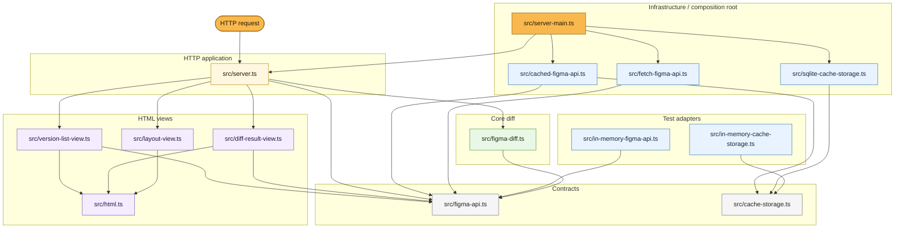

# figma-diff

Small Bun app buat compare current Figma file dengan version tertentu.

## Setup

```bash
bun install
cp .env.example .env
```

Isi `.env`:

```bash
FIGMA_ACCESS_TOKEN=figd_your_token_here
FIGMA_FILE_KEY=AbCdEfGhIjKlMnOpQrStUv
FIGMA_FILE_NAME=Example-Figma-File
PORT=3000
```

## Run

```bash
bun run server
```

Buka:

```text
http://localhost:3000
```

Default server pakai Figma API live + SQLite cache di `figma-cache.sqlite`.

## Test

```bash
bun test
```

Typecheck:

```bash
bunx tsc --noEmit
```

## Screenshot Views

```bash
bun run view-test
```

Output disimpan ke `screenshots/`.

## Behavior

- Version list membuka `/diff?version=<version-id>`.
- Diff membandingkan selected version sebagai `before` dengan current Figma file sebagai `after`.
- Diff routes fetch file pakai `depth=3`.
- Cache key file response pakai `depth` dari request options.
- Link Figma untuk `before` pakai `version-id`.
- Link Figma untuk `after` / current tidak pakai `version-id`.

## Architecture


